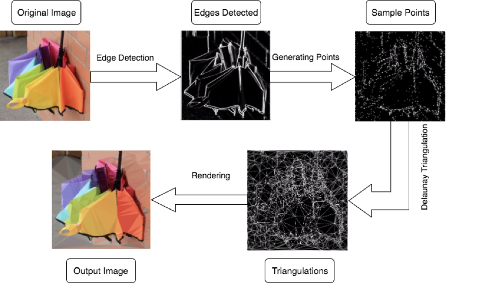

# Delaunay Triangulation On 2D Images

This project consists of several parts:

1. Edge Blur
2. Edge Detection
3. Sample Points Generation
4. Delaunay Triangulation
5. Rendering

## Edge Blur
Light-weight Guassian blur is applied as pre-processing the image because sometimes details of an image is concentrated in one small area like the following example which makes the output of delaunay triangulation not looking good.

## Edge Detection
Edge detection can preserve the primary frame and information of one image which tells where to focus on. The more points generated along the edges, the more detailed output image there will be.

Solbel operator is applied, and the gradient threshold can be adjusted by user, depending on how abstract the user wants. The lower threshold is, the more details will be in the output image.

## Sample Points Generation
As it is mentioned above, most of the sample points will be generated along the edges. However, in order to make a nice generate delaunay triangulations of an entire image, sample points are also needed apart from the ones along edges. Therefore, I decided to randomly generate sample points in the image with a certain point distribution rate which can also be set by users.

## Delaunay Triangulation
Bowyer-Watson algorithm is implemented to do delaunay triangulation with all the sample points generated.

## Rendering
A brute-force way is applied instead of the more elegant K-means to decide the color for each triangle. I use the pixel value of each triangle's center of gravity to fill the whole triangle. The output image looks good enough and it is more time efficient in this way.

## Example Flowchart

## Demo
[Demo (Version 1.0)](https://lijingyang.me/work_1_final_demo.html)

## Local
Run local server to serve index.html, e.g.
* `ruby -run -e httpd . -p 3000` (default port 8080)
* `python3 -m http.server -d . 3000` (default port 8000)
=> http://127.0.0.1:3000/
